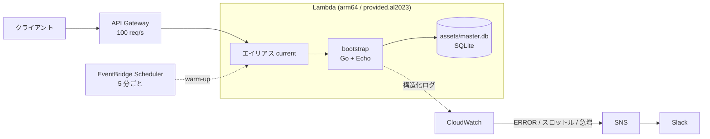

# kusuri-api-poc

- 添付文書 Pocket の API の PoC
- Go + Echo で実装し、Lambda へデプロイする

## セットアップ

1. [mise](https://mise.jdx.dev/) をインストールする

2. `.env` を生成

```sh
cp .env.example .env
```

3. ツールの導入・依存の取得・ローカル DB の作成をおこなう

```sh
make setup
```

- Go と Terraform のバージョンは [mise.toml](mise.toml) に固定 (CI も同じ値を使う)

4. ローカルサーバー起動

```sh
make run # http://localhost:8080 で起動
```

- API 仕様書は http://localhost:8080/docs で開ける

## 環境変数

- 一覧は [config.go](internal/config/config.go) を参照

### local 環境
- `.env` に書かれた値を mise が読み込み設定

### dev・prod 環境

- SSM パラメータストアに置いた値を、Terraform が apply 時に読み取って Lambda の環境変数として設定 (→ [初回設定](#初回設定))

## 公開構成



| 要素 | 役割 | 定義 |
|---|---|---|
| API Gateway | 流量制限 (課金の上限)。超過分は Lambda に届かない | [api_gateway.tf](terraform/modules/api/api_gateway.tf) |
| エイリアス `current` | 公開中のバージョンを指す。疎通確認後に切り替える | [lambda.tf](terraform/modules/api/lambda.tf) |
| warm-up | コールドスタートを避ける定期実行。効くのは同時実行 1 枠分 | [warmup.tf](terraform/modules/api/warmup.tf) |
| 監視 | ERROR 件数・スロットル・リクエスト急増を Slack へ通知 | [monitoring.tf](terraform/modules/api/monitoring.tf) |

- コールドスタートの計測結果は [検証レポート](docs/coldstart-report.md) を参照 (Function URL 時代の計測)

## 開発フロー

### デプロイ

- `release/dev`・`release/prod` へのマージで、対応する環境へのインフラ構築・アプリケーションのデプロイをする CI (GitHubActions) が走る

### インフラ

- Terraform で管理する
- `release/*` ブランチへのマージで生成される

### 初回設定

1. `terraform/initial_setup/env/<env>/locals.tf` の `subject_prefix` に、OIDC トークンの `sub` のプレフィックスを設定する。プレフィックスは以下で取得する。

```sh
gh api /repos/<owner>/<repo>/actions/oidc/customization/sub --jq '.sub_claim_prefix'
```

2. tfstate の保存先と IAM ロールを作成する

```sh
make tf-setup ENV=dev
make tf-setup ENV=prod
```

3. GitHub に、シークレットを登録する

- `AWS_ACCOUNT_ID`: OIDC で引き受けるロールの ARN 組み立てに使用

4. Slack の識別子を SSM パラメータストアに登録する

秘密情報は `/kusuri-api-poc/<env>/` 配下に `SecureString` で置き、Terraform が apply 時に読み取って Lambda の環境変数として設定する。CI へは値を渡さない。

| パラメータ | 作成者 |
| --- | --- |
| `docs_user` / `docs_password` | Terraform が生成する。手作業は不要 |
| `slack_team_id` / `slack_channel_id` | 手作業で登録する |

```sh
aws ssm put-parameter --type SecureString \
  --name /kusuri-api-poc/dev/slack_channel_id --value "C01ABCDEFGH"
```

Slack の識別子は、AWS コンソール ( Amazon Q Developer in chat applications ) でワークスペースを認可すると得られる。認可しない場合は `locals.tf` の `slack_enabled` を `false` にすると、パラメータなしで apply できる。

仕様書の資格情報は Terraform が生成するため、使うときは SSM から読み出す。値を変えたい場合は SSM を直接書き換える ( Terraform は上書きしない ) 。

```sh
aws ssm get-parameter --name /kusuri-api-poc/dev/docs_password \
  --with-decryption --query Parameter.Value --output text
```

## その他役立ちコマンド

```sh
make test      # go test -race ./...
make format    # gofmt -w .
make lint      # golangci-lint (設定は .golangci.yml)
make gen-db    # ローカル DB を作り直す
make build     # bootstrap のみ生成 (クロスコンパイルの確認用)
make zip       # build と gen-db を実行し fn.zip にまとめる
make clean     # 生成物とビルド/テストキャッシュを削除

make tf-fmt                   # terraform fmt -recursive
make tf-validate ENV=dev      # Terraform の構文チェック
make tf-plan ENV=dev          # インフラの差分確認
make tf-setup ENV=dev         # tfstate の保存先と IAM ロールを作成 (環境ごとに一度だけ)
```

- `ENV` は既定値を持たない。環境の取り違えを防ぐため、毎回明示する
