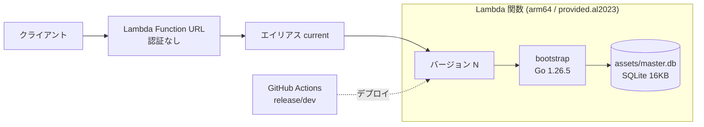
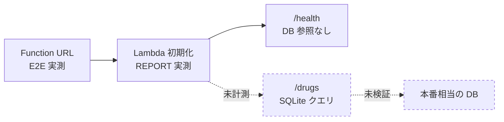

# Lambda 上の Go + SQLite に関する検証レポート

| | |
|---|---|
| 対象 | 添付文書 Pocket API (kusuri-api-poc) |
| 検証日 | 2026-08-16 |
| 環境 | AWS Lambda / ap-northeast-1 / dev |
| 作成 | Yusuke Inoue |

---

## 1. 概要

Lambda 上で Go + SQLite は動作した。ウォーム約 30ms、コールドスタートは当初 376ms だったが、ビルド時にデバッグ情報を落として 253ms まで短縮した (→ [9 章](#9-実施した改善と再計測))。一方でメモリサイズの結論は本番データでは覆る。検証に使った DB が 3 行しかなく、SQLite へのクエリを一度も計測していないため。

### 検証項目と判定

| # | 検証項目 | 判定 | 根拠 |
|---|---|---|---|
| 1 | Lambda 上で Go + SQLite が動作するか | ○ | `provided.al2023` / arm64 で `/drugs` が正常応答 |
| 2 | デプロイとロールバックの機構が機能するか | ○ | バージョン発行 → 疎通確認 → エイリアス切替が期待どおり動作 |
| 3 | コールドスタートは許容範囲か | △ | 改善後 253ms。許容値が未定のため判定保留 |
| 4 | 適切なメモリサイズはいくつか | × | 今回のデータ量では判断できない (→ [7 章](#7-計測範囲の制約)) |

以降の 5 章から 8 章は改善前の構成 (zip 9.7MB) に対する計測結果を扱う。改善の内容と再計測は 9 章にまとめた。

---

## 2. 背景と目的

添付文書 Pocket の API を Lambda で構築するにあたり、外部 DB を持たずに SQLite をデプロイパッケージへ同梱する構成が成立するかを確かめる。

論点は 2 つ。

- **動作するか** — SQLite ドライバは cgo を要求するものが多く、Lambda のカスタムランタイムでは制約になる
- **コールドスタートが許容範囲か** — DB を同梱するとパッケージが肥大し、起動時間に跳ね返る

---

## 3. 検証環境



| 項目 | 値 |
|---|---|
| ランタイム | `provided.al2023` |
| アーキテクチャ | arm64 |
| Go | 1.26.5 |
| SQLite ドライバ | `modernc.org/sqlite` (純 Go、cgo 不要) |
| デプロイパッケージ | zip 9.7MB (bootstrap 展開後 18.3MB + master.db 16KB) |
| メモリ (現行) | 512 MB |
| タイムアウト | 10 秒 |
| DB の件数 | 3 行 |

---

## 4. 検証方法

### 4.1 コールドスタートの強制

Lambda は設定を更新すると実行環境を破棄する。この性質を使い、1 回の計測ごとに環境変数を書き換えて確実にコールドスタートを起こした。

```
メモリ変更 + 環境変数書き換え
  → function-updated を待機
  → invoke --log-type Tail
  → REPORT 行から Init Duration / Duration / Max Memory Used を取得
```

対象は `$LATEST` のみとし、公開中のエイリアス `current` には影響させていない。メモリサイズは 128 / 256 / 512 / 1024 / 1769 MB の 5 水準で、各 5 回計測した。1769MB は Lambda が 1 vCPU を割り当てる境界にあたる。

### 4.2 E2E レイテンシ

REPORT 行の Init Duration には、デプロイパッケージの取得・展開が含まれない。クライアントから見た実際の待ち時間を測るため、Function URL へ curl でリクエストした。

- **コールドスタート** — 10 並列で投げ、新規実行環境を強制
- **ウォーム** — 逐次 5 回。`time_appconnect` と `time_starttransfer` を取り、TLS ハンドシェイクを分離

---

## 5. 結果

### 5.1 メモリサイズ別のコールドスタート

| メモリ | Init 平均 | Init 範囲 | ハンドラ実行 | Max Memory Used |
|---|---|---|---|---|
| 128 MB | 89.8 ms | 85.9 – 96.2 | 4.40 ms | 24 MB |
| 256 MB | 90.1 ms | 80.3 – 97.8 | 2.34 ms | 24 MB |
| 512 MB (現行) | 87.6 ms | 84.4 – 95.3 | 2.78 ms | 27 MB |
| 1024 MB | 98.8 ms | 91.5 – 108.0 | 2.64 ms | 27 MB |
| 1769 MB | 97.3 ms | 88.2 – 101.0 | 2.40 ms | 26 MB |

メモリを 14 倍にしても Init Duration は 88〜99ms の範囲に収まり、相関が見られない。Max Memory Used はいずれも 24〜27MB で、512MB は 20 倍の過剰割り当てにあたる。

### 5.2 コールドスタートの内訳

Function URL への 10 並列リクエストは 327〜424ms (中央値 376ms) だった。この内訳は以下のとおり。

| 区間 | 時間 | 割合 | 計測方法 |
|---|---|---|---|
| ネットワーク + TLS | ~30 ms | 9% | curl 実測 |
| パッケージ取得・展開 | ~230 ms | 65% | 差分からの推定 |
| Init Duration | 90 ms | 25% | REPORT 行 |
| ハンドラ実行 | 3 ms | 1% | REPORT 行 |

パッケージ取得の区間は CloudWatch の REPORT 行に現れない。E2E から他の区間を引いて求めた推定値であり、直接は計測していない。

### 5.3 ウォーム時の応答

| 区間 | 時間 |
|---|---|
| E2E (TLS ハンドシェイク込み) | 56 ms |
| TLS ハンドシェイク | 28 ms |
| サーバー側 (TLS を除く) | 28 ms |
| うちハンドラ実行 | 3 ms |

接続を確立済みのクライアントから見れば、実質 28ms で応答が返る。

### 5.4 Init Duration の内訳

`GODEBUG=inittrace=1` でパッケージ初期化を、`main()` に時刻の記録を挟んで残りを計測した (3 回平均、512MB)。

| 区間 | 時間 | 割合 | 計測方法 |
|---|---|---|---|
| 実行ファイルのロード + Go ランタイム起動 | ~57 ms | 65% | 差分からの推定 |
| パッケージ init (52 個) | 23.8 ms | 27% | `inittrace` 実測 |
| `main()` | 7.3 ms | 8% | コード計測 |

パッケージ init の上位は以下のとおり。

| パッケージ | 時間 |
|---|---|
| `modernc.org/sqlite/lib` | 8.1 ms |
| `net/http` | 2.7 ms |
| `github.com/go-playground/validator/v10` | 2.2 ms |
| `modernc.org/mathutil` | 2.0 ms |
| `crypto/sha256` + `crypto/md5` | 3.2 ms |
| その他 46 個 | 5.6 ms |

`main()` の内訳は `sqlite.Connect` (open + ping) が 5.8ms、`server.New` が 1.5ms、`logging.Init` が 3µs。

---

## 6. 考察

### 6.1 初期化が CPU を使っていない

Lambda は CPU をメモリに比例して割り当て、1769MB で 1 vCPU に相当する。128MB はその約 1/14 だが、Init Duration に差が出なかった。Go のバイナリ初期化と 16KB の SQLite ファイルを開く処理が、CPU をほとんど消費しないため。

同じ理由でハンドラ実行も 2〜4ms に収まり、メモリ間で差がない。**現在の計測対象は CPU バウンドではなく、メモリを増やす余地がそもそも存在しない。**

### 6.2 コールドスタートを支配するのはバイナリサイズ

パッケージ取得・展開が全体の 65% を占める。ここで運ばれる 9.7MB の内訳は Go バイナリがほぼすべてで、SQLite の DB ファイルは 16KB にすぎない。

**今回のコールドスタートはバイナリサイズに支配されており、データ量はまだ関与していない。** 短縮を図るならメモリ増設ではなくパッケージの削減が効く。

### 6.3 アプリコードで削れる初期化はほとんどない

Init Duration の 65% は実行ファイルのロードと Go ランタイムの起動で、アプリ側からは触れない。残る 35% も、内訳を見ると削減余地が乏しい。

- `modernc.org/sqlite/lib` の 8.1ms は SQLite 本体であり外せない
- `main()` の 5.8ms は DB を開いて疎通確認する処理であり、遅延させても総時間は変わらない
- 削除できるのは `validator` 系の 2.2ms 程度

Go のリンカは到達不能コードを既に除去しているため、依存を減らす施策で得られるのは合計 5〜10ms にとどまる。**init を大きく縮めるにはバイナリを小さくするか、言語ランタイムそのものを変えるしかない。**

---

## 7. 計測範囲の制約

結果を読むうえで、以下の 3 点を前提とする必要がある。



| # | 制約 | 影響 |
|---|---|---|
| 1 | DB が 3 行しかない | データ量に依存する結論がすべて未検証 |
| 2 | 計測したのは `/health` のみ | SQLite のクエリ性能が数字に反映されていない |
| 3 | パッケージ取得の区間は推定値 | 内訳の配分に誤差がある |

DB は起動時に開かれるため Init Duration には含まれるが、検索そのものは一度も実行していない。

---

## 8. 本検証の限界

7 章の制約により、以下の結論は本番規模では成立しない可能性がある。維持されるものと分けて示す。

### 8.1 覆る: 「128MB で足りる」

Max Memory Used の 24〜27MB は Go ランタイムの下駄であって、データ由来ではない。

差が出なかったのはハンドラ実行が 2〜4ms で CPU を使っていないため ([6.1](#61-初期化が-cpu-を使っていない))。全文検索・ソート・大きな JSON の生成が入れば処理は CPU バウンドに変わり、128MB は 1769MB の約 1/14 の CPU で動くことになる。

### 8.2 覆る: 「コールドスタート 250〜350ms」

この値はパッケージ取得が過半を占める (改善前 65%、改善後も 51%)。DB を同梱する方式では、添付文書の本文をどこまで持たせるかで zip サイズが桁で変わる。

Lambda の上限は zip 50MB・展開後 250MB で、本文を全件同梱すると収まらない可能性が高い。その場合はコンテナイメージ・EFS・S3 からの取得のいずれかへ設計が変わり、コールドスタートの内訳も別物になる。

### 8.3 要確認: 「Init Duration はメモリ非依存」

初期化が CPU バウンドでないことが前提。バイナリの肥大化、起動時のインデックス構築、Secrets Manager からの取得などを足すと、低メモリでの初期化が伸びる。

### 8.4 要確認: DB の更新方式

`/var/task` は読み取り専用で、同梱した DB へは書き込めない。マスタ更新をデプロイで行う限り問題にならないが、アプリ側から書き込む要件が出た時点で構成の見直しが必要になる。

### 8.5 維持: Go + SQLite が Lambda で動くこと

`modernc.org/sqlite` は純 Go のため cgo なしで arm64 向けにクロスコンパイルでき、`provided.al2023` 上で動作した。デプロイ手順も期待どおり機能した。この結論はデータ量に依存しない。

---

## 9. 実施した改善と再計測

6.2 の結論を受けて、ビルド時にデバッグ情報を落とす変更を入れた。

```makefile
build:
	CGO_ENABLED=0 GOOS=linux GOARCH=arm64 go build -tags lambda.norpc -trimpath -ldflags="-s -w" -o bootstrap .
```

| 項目 | 改善前 | 改善後 | 差 |
|---|---|---|---|
| bootstrap | 18.31 MB | 12.45 MB | −32% |
| zip | 9.76 MB | 4.98 MB | −49% |
| パッケージ取得 (推定) | ~255 ms | ~128 ms | −50% |
| Init Duration | 87.6 ms | 92.0 ms | ±0 |
| E2E コールドスタート (中央値) | 376 ms | 253 ms | **−33%** |
| ウォーム | 56 ms | 57 ms | ±0 |

縮んだのはパッケージ取得の区間だけで、Init Duration とウォーム時の応答は変わらない。zip が半分になった分がそのまま出ている。

`-s -w` が落とすのは DWARF デバッグ情報とシンボルテーブルで、Go の panic トレースは pclntab から復元される。関数名は残るため、障害調査への影響はない。

### 9.1 検討したが採らなかった手段

| 手段 | 見込み | 採らなかった理由 |
|---|---|---|
| 依存の削減 (`validator` など) | 5〜10 ms | 効果が小さく、検証ロジックの手書きが必要になる |
| Provisioned Concurrency | コールドスタートの解消 | 常時課金。許容値が未定の段階では数を決められない |
| EventBridge による定期 warm-up | 同時実行 1 枠分を解消 | 別途導入する |
| Rust への移行 | E2E 100〜130 ms | `rusqlite` は C の SQLite を使うため、cgo 回避という設計上の前提が失われる |

---

## 10. 結論と次のアクション

構成そのものは成立する。判断を保留しているのはメモリサイズとコールドスタートの許容可否で、いずれも本番相当のデータがなければ決められない。

1. **マスタ DB の設計を決める** — 添付文書の本文を同梱するのか、検索インデックスだけを持って本文は別に置くのか。パッケージサイズの上限に当たるかがここで決まる
2. **本番相当の件数で再計測する** — ダミー DB を生成し、`/drugs` のクエリを含めて計測する。メモリ 128MB と 1769MB の差が出るのはこの段階
3. **コールドスタートの許容値を決める** — 現状の 253ms が問題にならないなら、メモリを下げてコストを削る判断ができる

---

## 付録. 生データ

<details>
<summary>コールドスタート計測 (25 回)</summary>

| メモリ | 回 | Init (ms) | 実行 (ms) | 課金 (ms) | Max Memory (MB) |
|---|---|---|---|---|---|
| 128 | 1 | 85.87 | 1.93 | 88 | 24 |
| 128 | 2 | 87.84 | 1.99 | 90 | 24 |
| 128 | 3 | 96.22 | 10.23 | 107 | 24 |
| 128 | 4 | 86.33 | 5.77 | 93 | 24 |
| 128 | 5 | 92.87 | 2.07 | 95 | 24 |
| 256 | 1 | 94.57 | 3.65 | 99 | 24 |
| 256 | 2 | 80.33 | 1.42 | 82 | 24 |
| 256 | 3 | 97.77 | 2.53 | 101 | 24 |
| 256 | 4 | 86.08 | 2.01 | 89 | 24 |
| 256 | 5 | 91.80 | 2.11 | 94 | 24 |
| 512 | 1 | 86.94 | 2.79 | 90 | 25 |
| 512 | 2 | 85.31 | 1.62 | 87 | 27 |
| 512 | 3 | 95.33 | 3.45 | 99 | 25 |
| 512 | 4 | 86.14 | 2.80 | 89 | 27 |
| 512 | 5 | 84.41 | 3.25 | 88 | 27 |
| 1024 | 1 | 91.47 | 2.68 | 95 | 27 |
| 1024 | 2 | 107.96 | 2.09 | 111 | 28 |
| 1024 | 3 | 98.11 | 3.78 | 102 | 26 |
| 1024 | 4 | 95.71 | 2.86 | 99 | 27 |
| 1024 | 5 | 100.71 | 1.77 | 103 | 27 |
| 1769 | 1 | 100.99 | 3.26 | 105 | 26 |
| 1769 | 2 | 88.22 | 1.81 | 91 | 26 |
| 1769 | 3 | 98.01 | 1.77 | 100 | 26 |
| 1769 | 4 | 98.49 | 3.27 | 102 | 26 |
| 1769 | 5 | 100.65 | 1.88 | 103 | 26 |

</details>

<details>
<summary>E2E レイテンシ (Function URL)</summary>

コールドスタート (10 並列、秒):

```
0.327  0.341  0.345  0.347  0.373  0.378  0.384  0.385  0.416  0.424
```

ウォーム (逐次 5 回、秒):

| DNS | TCP | TLS | TTFB | 合計 |
|---|---|---|---|---|
| 0.0023 | 0.0135 | 0.0298 | 0.0737 | 0.0738 |
| 0.0020 | 0.0128 | 0.0276 | 0.0562 | 0.0563 |
| 0.0022 | 0.0129 | 0.0277 | 0.0551 | 0.0552 |
| 0.0020 | 0.0128 | 0.0271 | 0.0571 | 0.0572 |
| 0.0025 | 0.1038 | 0.1202 | 0.1508 | 0.1509 |

5 回目は TCP 接続に時間がかかった外れ値。

</details>

<details>
<summary>Init Duration の内訳 (3 回)</summary>

| 回 | Init Duration | パッケージ init | `main()` | 差分 (ロード + ランタイム起動) |
|---|---|---|---|---|
| 1 | 80.75 ms | 22.39 ms | 4.69 ms | 53.67 ms |
| 2 | 89.55 ms | 23.96 ms | 10.30 ms | 55.29 ms |
| 3 | 93.55 ms | 25.12 ms | 6.95 ms | 61.48 ms |

`main()` の内訳:

| 回 | `logging.Init` | `sqlite.Connect` | `server.New` |
|---|---|---|---|
| 1 | 2.4 µs | 2.43 ms | 2.26 ms |
| 2 | 2.3 µs | 10.24 ms | 0.06 ms |
| 3 | 2.8 µs | 4.67 ms | 2.28 ms |

計測は `GODEBUG=inittrace=1` と `main()` への一時的な時刻記録による。記録用のコードは計測後に削除した。

</details>
